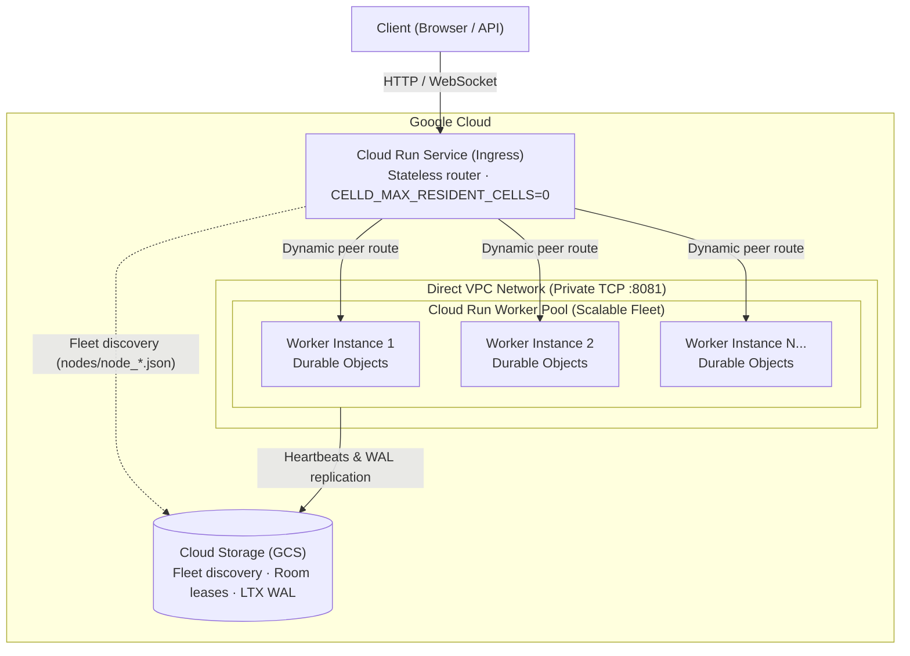

# Celld on Google Cloud Run

Deploy [Celld](https://github.com/denoland/celld) (`>=0.2.1`) on Google Cloud Run and Google Cloud Storage.

---

## Architecture



- **Cloud Run Service (Ingress)**: Stateless, request-driven entry point that routes client connections. It reads live fleet state from Cloud Storage to discover all backend workers and load-balances Durable Object rooms across them over Direct VPC.
- **Cloud Run Worker Pool (Workers)**: Scalable backend fleet (`instances=1..N`). Each worker instance hosts resident Durable Object isolates in RAM, advertises its private Direct VPC address, and persists state changes to Cloud Storage.
- **Cloud Storage (GCS)**: Serves as the distributed cluster plane (fleet discovery, room lease coordination) and persistent object storage for LTX WAL replication.

### How Fleet Scaling Works

To scale backend capacity, update the Worker Pool instance count with a single command:

```bash
gcloud beta run worker-pools update "${PREFIX}-workers" \
  --project="$PROJECT_ID" \
  --region="$REGION" \
  --instances=5
```

1. Each newly provisioned worker receives a private VPC IP and queries it from the instance metadata server.
2. The worker registers its presence in Cloud Storage (`gs://${BUCKET}/main/nodes/node_<id>.json`).
3. The Ingress Service reads active node records from Cloud Storage and routes newly requested Durable Object rooms across the expanded worker fleet over Direct VPC.

---

## Estimated Cost

- **Worker Pool**: 1 instance (1 vCPU / 1 GiB) is continuously provisioned at **~$32.79 / month**.
- **Ingress Service**: Standard Cloud Run request-based pricing (scales to zero when idle).
- **Cloud Storage**: Standard regional storage + Class A operations ($0.005 per 1,000 operations).

---

## Prerequisites

- [Google Cloud SDK (`gcloud`)](https://cloud.google.com/sdk/docs/install) with `beta` components (`gcloud components install beta`)
- [Celld CLI](https://github.com/denoland/celld) (`v0.2.1` or later) and `esbuild` on your `PATH`

---

## Quickstart

### 1. Configure Environment

```bash
export PROJECT_ID="your-project-id"
export REGION="us-west1"
export PREFIX="celld-demo"
export BUCKET="${PROJECT_ID}-${PREFIX}-fleet"
export CELLD_BUCKET="gs://${BUCKET}/main"

gcloud config set project "$PROJECT_ID"
```

### 2. Enable APIs

```bash
gcloud services enable \
  run.googleapis.com \
  compute.googleapis.com \
  storage.googleapis.com \
  iap.googleapis.com \
  --project="$PROJECT_ID"
```

### 3. Create Cloud Storage Bucket

```bash
gcloud storage buckets create "gs://${BUCKET}" \
  --project="$PROJECT_ID" \
  --location="$REGION" \
  --uniform-bucket-level-access
```

### 4. Build and Deploy Application Bundle

Build and upload the application bundle (`example-counter/`) to Cloud Storage:

```bash
celld deploy example-counter --bucket "$CELLD_BUCKET"
```

### 5. Deploy Backend Workers (Worker Pool)

Celld operates as a peer-to-peer cluster where nodes communicate directly over private TCP port 8081 to coordinate cell leases and forward requests. To enable private peer-to-peer communication between Cloud Run instances without public routing, we attach the Worker Pool to **Direct VPC**.

During startup, the worker queries its assigned private VPC IP from the instance metadata server and advertises it to the Celld fleet:

```bash
WORKER_CMD=$(cat <<'EOF'
# Retrieve Direct VPC IP from instance metadata server
metadata_ip() {
  exec 3<>/dev/tcp/metadata.google.internal/80
  printf 'GET /computeMetadata/v1/instance/network-interfaces/0/ip HTTP/1.1\r\nHost: metadata.google.internal\r\nMetadata-Flavor: Google\r\nConnection: close\r\n\r\n' >&3
  IFS= read -r status <&3
  [[ "$status" == *" 200 "* ]]
  while IFS= read -r line <&3; do [[ "$line" == $'\r' ]] && break; done
  cat <&3
}
ip=$(metadata_ip)
exec /usr/local/bin/celld --bucket "$CELLD_BUCKET" \
  --internal-listen "0.0.0.0:8081" \
  --advertise "$ip:8081"
EOF
)

gcloud beta run worker-pools deploy "${PREFIX}-workers" \
  --project="$PROJECT_ID" \
  --region="$REGION" \
  --image="ghcr.io/denoland/celld:v0.2.1" \
  --instances=1 \
  --cpu=1 \
  --memory=1Gi \
  --network=default \
  --subnet=default \
  --command=/bin/bash \
  --args="-c,$WORKER_CMD" \
  --set-env-vars="CELLD_BUCKET=${CELLD_BUCKET}"
```

### 6. Deploy Public Entry Point (Cloud Run Service)

Cloud Run Worker Pools have no public endpoints. We deploy a standard Cloud Run Service in front to provide the HTTPS/WebSocket URL for clients. This service accepts incoming client connections and proxies them across Direct VPC to the backend workers:

```bash
gcloud run deploy "${PREFIX}-ingress" \
  --project="$PROJECT_ID" \
  --region="$REGION" \
  --image="ghcr.io/denoland/celld:v0.2.1" \
  --no-allow-unauthenticated \
  --network=default \
  --subnet=default \
  --vpc-egress=private-ranges-only \
  --port=8080 \
  --timeout=3600s \
  --set-env-vars="CELLD_BUCKET=$CELLD_BUCKET,CELLD_ADDR=0.0.0.0:8080,CELLD_INTERNAL_ADDR=127.0.0.1:8081,CELLD_MAX_RESIDENT_CELLS=0"
```

### 7. Secure & Access the Application

The Cloud Run Service is deployed with `--no-allow-unauthenticated` by default so it is not exposed to the public internet. You can access and protect the application using either Identity-Aware Proxy (IAP) or local CLI proxying:

#### Option A: Browser Access with Identity-Aware Proxy (IAP)
Enable native Cloud Run IAP to secure the application behind Google OAuth SSO, allowing authorized users and teammates to access the HTTPS URL directly in their browser without local developer tooling:

```bash
# 1. Enable native IAP on Cloud Run
gcloud alpha run services update "${PREFIX}-ingress" \
  --project="$PROJECT_ID" \
  --region="$REGION" \
  --iap

# 2. Grant IAP web access to your user account or Google Workspace domain
USER_EMAIL="$(gcloud config get-value account)"
gcloud alpha iap web add-iam-policy-binding \
  --project="$PROJECT_ID" \
  --resource-type=cloud-run \
  --service="${PREFIX}-ingress" \
  --region="$REGION" \
  --member="user:${USER_EMAIL}" \
  --role="roles/iap.httpsResourceAccessor"
```

Retrieve the service URL and open `/alpha` in your browser:
```bash
SERVICE_URL=$(gcloud run services describe "${PREFIX}-ingress" --project="$PROJECT_ID" --region="$REGION" --format='value(status.url)')
echo "Open: ${SERVICE_URL}/alpha"
```

#### Option B: Developer Access with `gcloud run services proxy`
If you prefer not to configure IAP, you can keep the service IAM-private and start an authenticated local tunnel using your active `gcloud` developer credentials:

```bash
gcloud run services proxy "${PREFIX}-ingress" \
  --project="$PROJECT_ID" \
  --region="$REGION" \
  --port=8080
```

Open `http://localhost:8080/alpha` in your browser. The proxy automatically injects your Google identity tokens into outgoing requests.

---

## Performance Observations

### 1. Cloud Run Durable Object Performance
Measures end-to-end transaction latency (isolate execution + SQLite write + regional GCS LTX WAL sync + WebSocket broadcast) on Cloud Run in `us-west1`:

| Metric | Measured Value |
| :--- | :--- |
| **Throughput** | 13.13 durable writes / sec |
| **Success Rate** | 100% (151 / 151 writes, 0 errors) |
| **Latency (Min)** | 75.19 ms |
| **Latency (p50)** | 90.33 ms |
| **Latency (p90)** | 108.18 ms |
| **Latency (p95)** | 118.60 ms |
| **Latency (p99)** | 377.05 ms |
| **GCS Mutation Rate** | 1 LTX WAL object created per durable write (+152 objects) |

### 2. Memory Density Measurements
- **Base Process Footprint**: ~30.47 MB RSS (0 resident cells).
- **Per-Resident Cell Memory**: ~1.43 MB RAM per active cell (includes V8 isolate heap, SQLite page cache, and LTX replication state).
- **File Descriptors**: 8 FDs per resident cell.

---

## Cleanup

To delete all resources and stop billing:

```bash
gcloud run services delete "${PREFIX}-ingress" --project="$PROJECT_ID" --region="$REGION" --quiet
gcloud beta run worker-pools delete "${PREFIX}-workers" --project="$PROJECT_ID" --region="$REGION" --quiet
gcloud storage rm --recursive "gs://${BUCKET}" --project="$PROJECT_ID" --quiet
```
