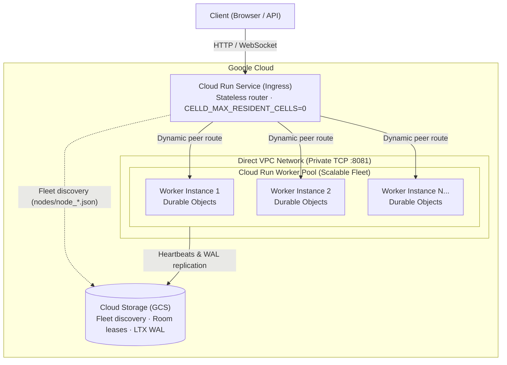

# Celld on Google Cloud Run

Deploy [Celld](https://github.com/denoland/celld) **v0.4.1** on Google Cloud Run with Durable Object state in Cloud Storage.

---

## Quickstart

Run a single celld node on a [Cloud Run Instance](https://docs.cloud.google.com/run/docs/instances/create-and-manage-instances).

Prerequisites:

- A billed GCP project and an authenticated, current [Google Cloud CLI](https://cloud.google.com/sdk/docs/install) with `gcloud beta run instances`.
- [celld v0.4.1](https://github.com/denoland/celld/releases/tag/v0.4.1), `esbuild`, and `git` installed.
- The default runtime service account needs [Storage Object Admin access](https://cloud.google.com/storage/docs/access-control/using-iam-permissions) to the bucket below.

### 1. Create a GCS bucket

```bash
export PROJECT_ID="your-project-id"
export REGION="us-south1"  # Supported regions: https://cloud.google.com/run/docs/instances/create-and-manage-instances#supported-regions
export BUCKET="your-bucket-name"  # Globally unique

gcloud storage buckets create "gs://${BUCKET}" \
  --project="$PROJECT_ID" --location="$REGION" --uniform-bucket-level-access
```

### 2. Deploy a sample app

```bash
git clone https://github.com/taeold/celld-cloud-run-demo.git
cd celld-cloud-run-demo
celld deploy example-counter --bucket "gs://${BUCKET}"
```

If the upload fails with missing or expired credentials, authenticate locally and retry:

```bash
gcloud auth application-default login
celld deploy example-counter --bucket "gs://${BUCKET}"
```

A permission-denied error with valid credentials means your account needs write access to the bucket.

### 3. Create the Instance

```bash
gcloud beta run instances create celld-demo \
  --project="$PROJECT_ID" --region="$REGION" \
  --image=ghcr.io/denoland/celld:v0.4.1 \
  --cpu=1 --memory=1Gi --port=8080 \
  --restart-policy=always --public \
  --set-env-vars="CELLD_BUCKET=gs://${BUCKET},CELLD_ADDR=0.0.0.0:8080,CELLD_INTERNAL_ADDR=127.0.0.1:8081,CELLD_ADVERTISE=127.0.0.1:8081"
```

- `--restart-policy=always`: Restart celld after any exit, including a clean exit. See [restart policies](https://cloud.google.com/run/docs/configuring/instances/restart-policy).
- `--port=8080` and `CELLD_ADDR`: Route HTTP requests to celld. The internal listener and advertised address use loopback because this is a single node.
- `--public`: Allow browser access without authentication for this demo.

### 4. Try it

Set `URL` to the HTTPS address printed by the create command:

```bash
URL="https://YOUR_CELLD_DEPLOYMENT_URL"
```

Read the counter, increment it twice, then read the stored value. A fresh `alpha` counter returns:

```bash
curl -fsS --retry 12 --retry-delay 5 --retry-all-errors "$URL/alpha/count"; echo
# {"count":0}

curl -fsS -X POST "$URL/alpha/count"; echo
# {"count":1}

curl -fsS -X POST "$URL/alpha/count"; echo
# {"count":2}

curl -fsS "$URL/alpha/count"; echo
# {"count":2}
```

Open `$URL/alpha` in a browser to see the same counter update over WebSocket. `/beta` has its own counter.

---

## Estimated Cost

- **Cloud Run Instance**: 1 vCPU / 1 GiB running continuously in `us-south1` costs approximately **$5.70/month**. See [pricing](https://cloud.google.com/run/pricing).
- **Cloud Storage**: Regional storage and operations are billed separately, along with any network transfer. See [storage pricing](https://cloud.google.com/storage/pricing).

Instances are **Preview / Pre-GA**.

---

## Scale-out architecture

For multi-node celld deployments, consider **Cloud Run Worker Pools**:



- **Cloud Run Service (Ingress)**: Stateless, request-driven entry point that routes client connections. It reads live fleet state from Cloud Storage to discover all backend workers and load-balances Durable Object rooms across them over Direct VPC.
- **Cloud Run Worker Pool (Workers)**: Scalable backend fleet (`instances=1..N`). Each worker instance hosts resident Durable Object isolates in RAM, advertises its private Direct VPC address, and persists state changes to Cloud Storage.
- **Cloud Storage (GCS)**: Serves as the distributed cluster plane (fleet discovery, room lease coordination) and persistent object storage for LTX WAL replication.

### How Fleet Scaling Works

To scale backend capacity, update the Worker Pool instance count with a single command:

```bash
gcloud beta run worker-pools update celld-demo-workers \
  --project="$PROJECT_ID" \
  --region="$REGION" \
  --instances=5
```

1. Each newly provisioned worker receives a private VPC IP and queries it from the instance metadata server.
2. The worker registers its presence in Cloud Storage (`gs://${BUCKET}/nodes/node_<id>.json`).
3. The Ingress Service reads active node records from Cloud Storage and routes newly requested Durable Object rooms across the expanded worker fleet over Direct VPC.

### Fleet Cost

- **Worker Pool**: Original estimate: 2 instances (1 vCPU / 1 GiB each) continuously provisioned at **~$65.58 / month**; 1 instance at **~$32.79 / month**. Worker Pools have different pricing from the single Instance above; check [current regional pricing](https://cloud.google.com/run/pricing).
- **Ingress Service**: Standard Cloud Run request-based pricing (scales to zero when idle).
- **Cloud Storage**: Standard regional storage + Class A operations ($0.005 per 1,000 operations).

---

## Deploy the scale-out fleet

```bash
export PROJECT_ID="your-project-id"
export REGION="us-west1"
export BUCKET="your-fleet-bucket"  # Contains your celld deployment
export NETWORK="default"
export SUBNET="default"
```

### 1. Deploy Backend Workers (Worker Pool)

Celld operates as a peer-to-peer cluster where nodes communicate directly over private TCP port 8081 to coordinate cell leases and forward requests. To enable private peer-to-peer communication between Cloud Run instances without public routing, we attach the Worker Pool to **Direct VPC**.

During startup, the worker queries its assigned private VPC IP from the instance metadata server and advertises it to the Celld fleet:

```bash
WORKER_CMD=$(cat <<'EOF'
# Retrieve Direct VPC IP from instance metadata server
metadata_ip() {
  exec 3<>/dev/tcp/metadata.google.internal/80
  printf 'GET /computeMetadata/v1/instance/network-interfaces/0/ip HTTP/1.1\r\nHost: metadata.google.internal\r\nMetadata-Flavor: Google\r\nConnection: close\r\n\r\n' >&3
  IFS= read -r status <&3
  [[ "$status" == *" 200 "* ]]
  while IFS= read -r line <&3; do [[ "$line" == $'\r' ]] && break; done
  cat <&3
}
ip=$(metadata_ip)
exec /usr/local/bin/celld --bucket "$CELLD_BUCKET" \
  --internal-listen "0.0.0.0:8081" \
  --advertise "$ip:8081"
EOF
)

gcloud beta run worker-pools deploy celld-demo-workers \
  --project="$PROJECT_ID" \
  --region="$REGION" \
  --image="ghcr.io/denoland/celld:v0.4.1" \
  --instances=2 \
  --cpu=1 \
  --memory=1Gi \
  --network="$NETWORK" \
  --subnet="$SUBNET" \
  --command=/bin/bash \
  --args="-c,$WORKER_CMD" \
  --set-env-vars="CELLD_BUCKET=gs://${BUCKET}"
```

### 2. Deploy Public Entry Point (Cloud Run Service)

Cloud Run Worker Pools have no public endpoints. We deploy a standard Cloud Run Service in front to provide the HTTPS/WebSocket URL for clients. This service accepts incoming client connections and proxies them across Direct VPC to the backend workers:

```bash
gcloud run deploy celld-demo-ingress \
  --project="$PROJECT_ID" \
  --region="$REGION" \
  --image="ghcr.io/denoland/celld:v0.4.1" \
  --no-allow-unauthenticated \
  --network="$NETWORK" \
  --subnet="$SUBNET" \
  --vpc-egress=private-ranges-only \
  --port=8080 \
  --timeout=3600s \
  --set-env-vars="CELLD_BUCKET=gs://${BUCKET},CELLD_ADDR=0.0.0.0:8080,CELLD_INTERNAL_ADDR=127.0.0.1:8081,CELLD_MAX_RESIDENT_CELLS=0"
```

> [!NOTE]
> If configuring an optional HTTP startup probe, use `httpGet.path=/.well-known/celld/health` for Celld `v0.4.0+` (or `/__celld/health` for `v0.2.1`–`v0.3.0`).

### 3. Secure & Access the Application

The Cloud Run Service is deployed with `--no-allow-unauthenticated` by default so it is not exposed to the public internet. You can access and protect the application using either Identity-Aware Proxy (IAP) or local CLI proxying:

#### Option A: Browser Access with Identity-Aware Proxy (IAP)
Enable native Cloud Run IAP to secure the application behind Google OAuth SSO, allowing authorized users and teammates to access the HTTPS URL directly in their browser without local developer tooling:

```bash
gcloud services enable iap.googleapis.com --project="$PROJECT_ID"
gcloud components install alpha
# 1. Enable native IAP on Cloud Run
gcloud alpha run services update celld-demo-ingress \
  --project="$PROJECT_ID" \
  --region="$REGION" \
  --iap

# IAP's service agent needs permission to invoke the IAM-private ingress.
PROJECT_NUMBER=$(gcloud projects describe "$PROJECT_ID" --format='value(projectNumber)')
gcloud beta services identity create --service=iap.googleapis.com --project="$PROJECT_ID"
gcloud run services add-iam-policy-binding celld-demo-ingress \
  --project="$PROJECT_ID" --region="$REGION" \
  --member="serviceAccount:service-${PROJECT_NUMBER}@gcp-sa-iap.iam.gserviceaccount.com" \
  --role=roles/run.invoker

# 2. Grant IAP web access to your user account or Google Workspace domain
USER_EMAIL="$(gcloud config get-value account)"
gcloud alpha iap web add-iam-policy-binding \
  --project="$PROJECT_ID" \
  --resource-type=cloud-run \
  --service=celld-demo-ingress \
  --region="$REGION" \
  --member="user:${USER_EMAIL}" \
  --role="roles/iap.httpsResourceAccessor"
```

Retrieve the service URL and open `/alpha` in your browser:
```bash
SERVICE_URL=$(gcloud run services describe celld-demo-ingress --project="$PROJECT_ID" --region="$REGION" --format='value(status.url)')
echo "Open: ${SERVICE_URL}/alpha"
```

Projects without an organization and users outside your organization may also need initial OAuth setup in the console; see [Google's IAP guide](https://docs.cloud.google.com/run/docs/securing/identity-aware-proxy-cloud-run). The developer proxy below avoids that setup for local testing.

#### Option B: Developer Access with `gcloud run services proxy`
If you prefer not to configure IAP, you can keep the service IAM-private and start an authenticated local tunnel using your active `gcloud` developer credentials:

```bash
gcloud run services proxy celld-demo-ingress \
  --project="$PROJECT_ID" \
  --region="$REGION" \
  --port=8080
```

Open `http://localhost:8080/alpha` in your browser. The proxy automatically injects your Google identity tokens into outgoing requests.

---

## Performance Observations

### 1. Cloud Run Durable Object Performance
Measures end-to-end transaction latency (isolate execution + SQLite write + regional GCS LTX WAL sync + WebSocket broadcast) on Cloud Run in `us-west1`:

These measurements are from the original deployment, not the new shared-CPU Instance.

| Metric | Measured Value |
| :--- | :--- |
| **Throughput** | 13.13 durable writes / sec |
| **Success Rate** | 100% (151 / 151 writes, 0 errors) |
| **Latency (Min)** | 75.19 ms |
| **Latency (p50)** | 90.33 ms |
| **Latency (p90)** | 108.18 ms |
| **Latency (p95)** | 118.60 ms |
| **Latency (p99)** | 377.05 ms |
| **GCS Mutation Rate** | 1 LTX WAL object created per durable write (+152 objects) |

### 2. Memory Density Measurements
- **Base Process Footprint**: ~30.47 MB RSS (0 resident cells).
- **Per-Resident Cell Memory**: ~1.43 MB RAM per active cell (includes V8 isolate heap, SQLite page cache, and LTX replication state).
- **File Descriptors**: 8 FDs per resident cell.

---

## More Examples

- [OpenCode](example-opencode/README.md): A minimal Worker with curl examples for creating, prompting, and resuming sessions.
- [Workflows](example-workflow/): A multi-step workflow with a built-in demo UI. Its in-memory workflow list is not a durable catalog; adapt the trace-console project link for your project.
- [Operational dashboard](dashboard/): A separate Python dashboard for workflows. Set `CELLD_BUCKET` and `CELLD_INGRESS_URL` to your deployment.

---

## Cleanup

Delete the resources you created to stop billing. **Deleting the bucket also deletes the deployed code and stored state.** To keep the data, stop the Instance instead; storage charges remain.

```bash
gcloud beta run instances delete celld-demo --project="$PROJECT_ID" --region="$REGION" --quiet
# Only if you deployed the scale-out topology:
gcloud run services delete celld-demo-ingress --project="$PROJECT_ID" --region="$REGION" --quiet
gcloud beta run worker-pools delete celld-demo-workers --project="$PROJECT_ID" --region="$REGION" --quiet
gcloud storage rm --recursive "gs://${BUCKET}" --project="$PROJECT_ID" --quiet
```
