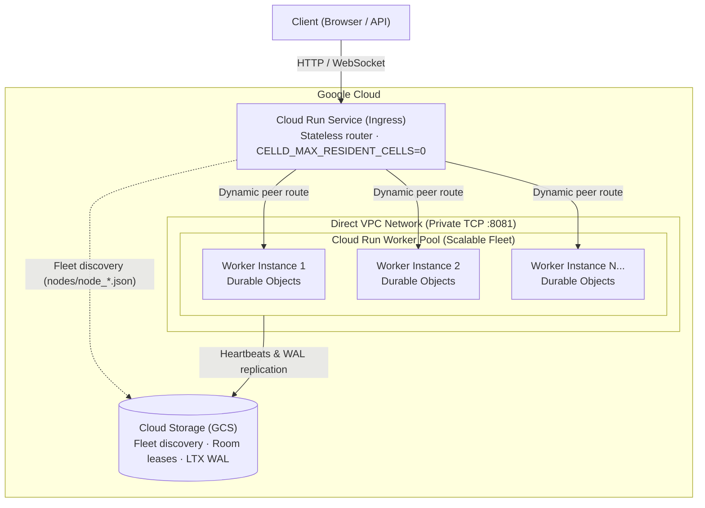

# Celld on Google Cloud Run

Deploy [Celld](https://github.com/denoland/celld) **v0.4.1** on Google Cloud Run with Durable Object state in Cloud Storage.

Start with one **Cloud Run Instance** for a small always-on app. Graduate to a **Cloud Run Service + Worker Pool + Direct VPC** when you need more resident objects, compute capacity, or lower write latency through peer-assisted durability.

## Quickstart: one Cloud Run Instance

The new [Cloud Run v2 Instance resource](https://docs.cloud.google.com/run/docs/instances/create-and-manage-instances) is a manually managed singleton with a stable HTTPS URL, shared CPU and continuous billing. It is **not** a Cloud Run Service with `--max-instances=1` (nor a Service using instance-based billing). It is currently **Preview / Pre-GA**, not a high-availability deployment. Instances run for up to seven days before restarting; local disk and memory are ephemeral. Celld recovers persisted Durable Object state from GCS, not from that disk. Expect brief interruptions and reconnect clients after restarts.

**Cost:** 1 vCPU / 1 GiB in `us-south1` is approximately **$5.70 for 30 continuous days** (~$5–6/month for compute), per [Google's Instance announcement](https://cloud.google.com/blog/products/serverless/introducing-cloud-run-instances). Storage, GCS operations, network transfer and taxes are additional. Shared CPU has a burst budget; this is not a continuously dedicated CPU at that price. A lone celld node waits for Cloud Storage acknowledgement on writes because it has no peer.

### 1. Prepare tools and credentials

Use Bash on Linux x86-64 (or adapt the binary filename for Linux ARM64 / macOS ARM64). You need `git`, `curl`, `gzip`, Node.js 22+ with npm, and the [current Google Cloud CLI](https://cloud.google.com/sdk/docs/install). Start with a **GCP project that has billing enabled**, and an account allowed to enable APIs, create buckets/Cloud Run resources, grant bucket permissions and use the default runtime service account (a project Owner is sufficient for this tutorial). Organization policies must permit public demos and the Preview resource.

```bash
gcloud components update
gcloud components install beta
gcloud auth login
gcloud auth application-default login  # celld deploy uses ADC, not gcloud's login

mkdir -p "$HOME/.local/bin"
curl -fL https://github.com/denoland/celld/releases/download/v0.4.1/celld-x86_64-unknown-linux-gnu.gz \
  | gzip -d > "$HOME/.local/bin/celld"
chmod +x "$HOME/.local/bin/celld"
export PATH="$HOME/.local/bin:$PATH"
celld --version  # celld 0.4.1

git clone https://github.com/taeold/celld-cloud-run-demo.git
cd celld-cloud-run-demo
npm install --prefix .tools esbuild@0.25.9
export PATH="$PWD/.tools/node_modules/.bin:$PATH"
```

If your CLI was installed through apt/yum, update it through that package manager instead. Check `gcloud beta run instances create --help` before continuing; an “Invalid choice: instances” error means your CLI is too old.

### 2. Prepare the project and storage

```bash
export PROJECT_ID="your-billed-project-id"
export REGION="us-south1"
export PREFIX="celld-demo"
export BUCKET="${PROJECT_ID}-${PREFIX}-fleet"  # must be globally unique
export CELLD_BUCKET="gs://${BUCKET}/main"
gcloud config set project "$PROJECT_ID"
gcloud auth application-default set-quota-project "$PROJECT_ID"
gcloud services enable run.googleapis.com compute.googleapis.com storage.googleapis.com \
  --project="$PROJECT_ID"

gcloud storage buckets create "gs://${BUCKET}" \
  --project="$PROJECT_ID" --location="$REGION" --uniform-bucket-level-access
PROJECT_NUMBER=$(gcloud projects describe "$PROJECT_ID" --format='value(projectNumber)')
RUNTIME_SA="${PROJECT_NUMBER}-compute@developer.gserviceaccount.com"
gcloud storage buckets add-iam-policy-binding "gs://${BUCKET}" \
  --member="serviceAccount:${RUNTIME_SA}" --role=roles/storage.objectAdmin
```

Enabling Compute Engine creates the default runtime service account. New projects do not necessarily give it Editor permissions; the bucket grant above is necessary for celld to read bundles, coordinate leases and persist state. No service-account key or mounted bucket is needed. `us-south1` supports Instances; check the linked Instance guide for current region exclusions.

### 3. Deploy the counter and start celld

```bash
celld deploy example-counter --bucket "$CELLD_BUCKET"
gcloud beta run instances create "${PREFIX}-single" \
  --project="$PROJECT_ID" --region="$REGION" \
  --image=ghcr.io/denoland/celld:v0.4.1 \
  --cpu=1 --memory=1Gi --port=8080 --restart-policy=always --public \
  --service-account="$RUNTIME_SA" \
  --set-env-vars="CELLD_BUCKET=${CELLD_BUCKET},CELLD_ADDR=0.0.0.0:8080,CELLD_INTERNAL_ADDR=127.0.0.1:8081,CELLD_ADVERTISE=127.0.0.1:8081"

# The stable URL format documented for Instances (not a Service status.url).
INSTANCE_URL="https://${PREFIX}-single-${PROJECT_NUMBER}.${REGION}.run.app"
curl --fail-with-body "${INSTANCE_URL}/.well-known/celld/health"
curl --fail-with-body "${INSTANCE_URL}/alpha"  # counter HTML
echo "Open ${INSTANCE_URL}/alpha and click Increment"
```

The stock image runs celld itself; there is no Artifact Registry build. Only the Worker HTTP port is exposed. The internal peer/operator port stays on loopback for this singleton. **`--public` is intentional for this counter tutorial:** anyone with the URL can change these demo counters. Do not put sensitive data in it. The flags above follow the [Instance CLI reference](https://docs.cloud.google.com/sdk/gcloud/reference/beta/run/instances/create); inspect readiness with `gcloud beta run instances describe "${PREFIX}-single" --project="$PROJECT_ID" --region="$REGION"` if a call fails.

The counter uses a WebSocket, so `curl /alpha` returns the UI, not a JSON count. Open the same room in two tabs: Increment updates both; reload to see the stored value. Different room paths (`/alpha`, `/beta`) have independent Durable Objects.

> [!TIP]
> **Hot deployments:** `celld deploy` uploads a bundle and changes the deployment pointer. v0.4.1 nodes poll `deploy/current.json` every 30 seconds by default (`CELLD_DEPLOY_POLL_S=30`) and adopt updates in place. Keep this bucket/prefix dedicated to this application.

### Next: a durable OpenCode session

[example-opencode](example-opencode/README.md) adds the pinned Workerd SDK, a real first-turn/resume API, and a small responsive UI. Try it locally first; it uses the free `opencode/nemotron-3.5-lightning-free` model. The model is an external service, so availability, limits and privacy terms still apply.

Also included: [example-workflow](example-workflow/) demonstrates workflows; [dashboard](dashboard/) is the separate operational dashboard, not required by either Quickstart. Those older samples retain deployment-specific tracing/dashboard defaults: set `CELLD_BUCKET` and `CELLD_INGRESS_URL` for the Python dashboard, and adapt the workflow's trace-console project link before using it in your own project. Its in-memory workflow list is not a durable catalog.

---

## Scale-out architecture

Use this topology when one node's RAM/CPU is no longer enough, or when synchronous GCS write latency limits your app. Two or more resident workers can use **peer-assisted fleet durability** before asynchronous GCS persistence; a singleton remains valid but waits for GCS. Worker Pools provide continuously running nodes and private, directly reachable peers. The request-driven Service is only the public router. Increasing a public Service's replica limit alone does not establish this private peer topology.

Scaling out is not a promise of zero downtime: test reconnection, recovery and capacity for your workload. To move the Quickstart's data, stop the singleton before starting the fleet against the same prefix; its loopback advertisement is not reachable from fleet nodes. Plan a maintenance window and let its old lease expire. Use a separate bucket/prefix for parallel experiments.



- **Cloud Run Service (Ingress)**: Stateless, request-driven entry point that routes client connections. It reads live fleet state from Cloud Storage to discover all backend workers and load-balances Durable Object rooms across them over Direct VPC.
- **Cloud Run Worker Pool (Workers)**: Scalable backend fleet (`instances=1..N`). Each worker instance hosts resident Durable Object isolates in RAM, advertises its private Direct VPC address, and persists state changes to Cloud Storage.
- **Cloud Storage (GCS)**: Serves as the distributed cluster plane (fleet discovery, room lease coordination) and persistent object storage for LTX WAL replication.

### How Fleet Scaling Works

To scale backend capacity, update the Worker Pool instance count with a single command:

```bash
gcloud beta run worker-pools update "${PREFIX}-workers" \
  --project="$PROJECT_ID" \
  --region="$REGION" \
  --instances=5
```

1. Each newly provisioned worker receives a private VPC IP and queries it from the instance metadata server.
2. The worker registers its presence in Cloud Storage (`gs://${BUCKET}/main/nodes/node_<id>.json`).
3. The Ingress Service reads active node records from Cloud Storage and routes newly requested Durable Object rooms across the expanded worker fleet over Direct VPC.

---

## Estimated Cost

- **Single Instance**: ~**$5.70 / 30 days** at 1 vCPU / 1 GiB in `us-south1`, with shared CPU (Quickstart above).
- **Worker Pool**: Original estimate: 2 instances (1 vCPU / 1 GiB each) continuously provisioned at **~$65.58 / month**; 1 instance at **~$32.79 / month**. These are a different resource and pricing model from the new Instance. Check [current regional pricing](https://cloud.google.com/run/pricing); ≥2 workers enable peer-assisted write acknowledgement, not a prerequisite for persistence.
- **Ingress Service**: Standard Cloud Run request-based pricing (scales to zero when idle).
- **Cloud Storage**: Standard regional storage + Class A operations ($0.005 per 1,000 operations).

---

## Deploy the scale-out fleet

Complete Quickstart steps 1–2 and upload your chosen example with `celld deploy` first. Reuse the environment variables and bucket grant. If the singleton is running, stop it:

```bash
gcloud beta run instances stop "${PREFIX}-single" --project="$PROJECT_ID" --region="$REGION"
```

The commands below use the `default` VPC and regional `default` subnet. Verify they exist (some organizations disable default-network creation), have a `/26` or larger subnet with free addresses, and permit **private TCP 8081 between ingress and worker addresses**. The default network's internal firewall rule normally allows this. On a custom VPC, create an appropriately scoped rule using subnet IP ranges and substitute your network/subnet; worker-pool ingress rules cannot target network tags or service identities. Do not expose the operator port to the internet. See [Direct VPC for Worker Pools](https://docs.cloud.google.com/run/docs/configuring/vpc-direct-vpc#worker-pools).

### 1. Deploy Backend Workers (Worker Pool)

Celld operates as a peer-to-peer cluster where nodes communicate directly over private TCP port 8081 to coordinate cell leases and forward requests. To enable private peer-to-peer communication between Cloud Run instances without public routing, we attach the Worker Pool to **Direct VPC**.

During startup, the worker queries its assigned private VPC IP from the instance metadata server and advertises it to the Celld fleet:

```bash
WORKER_CMD=$(cat <<'EOF'
# Retrieve Direct VPC IP from instance metadata server
metadata_ip() {
  exec 3<>/dev/tcp/metadata.google.internal/80
  printf 'GET /computeMetadata/v1/instance/network-interfaces/0/ip HTTP/1.1\r\nHost: metadata.google.internal\r\nMetadata-Flavor: Google\r\nConnection: close\r\n\r\n' >&3
  IFS= read -r status <&3
  [[ "$status" == *" 200 "* ]]
  while IFS= read -r line <&3; do [[ "$line" == $'\r' ]] && break; done
  cat <&3
}
ip=$(metadata_ip)
exec /usr/local/bin/celld --bucket "$CELLD_BUCKET" \
  --internal-listen "0.0.0.0:8081" \
  --advertise "$ip:8081"
EOF
)

gcloud beta run worker-pools deploy "${PREFIX}-workers" \
  --project="$PROJECT_ID" \
  --region="$REGION" \
  --image="ghcr.io/denoland/celld:v0.4.1" \
  --service-account="$RUNTIME_SA" \
  --instances=2 \
  --cpu=1 \
  --memory=1Gi \
  --network=default \
  --subnet=default \
  --command=/bin/bash \
  --args="-c,$WORKER_CMD" \
  --set-env-vars="CELLD_BUCKET=${CELLD_BUCKET}"
```

### 2. Deploy Public Entry Point (Cloud Run Service)

Cloud Run Worker Pools have no public endpoints. We deploy a standard Cloud Run Service in front to provide the HTTPS/WebSocket URL for clients. This service accepts incoming client connections and proxies them across Direct VPC to the backend workers:

```bash
gcloud run deploy "${PREFIX}-ingress" \
  --project="$PROJECT_ID" \
  --region="$REGION" \
  --image="ghcr.io/denoland/celld:v0.4.1" \
  --service-account="$RUNTIME_SA" \
  --no-allow-unauthenticated \
  --network=default \
  --subnet=default \
  --vpc-egress=private-ranges-only \
  --port=8080 \
  --timeout=3600s \
  --set-env-vars="CELLD_BUCKET=$CELLD_BUCKET,CELLD_ADDR=0.0.0.0:8080,CELLD_INTERNAL_ADDR=127.0.0.1:8081,CELLD_MAX_RESIDENT_CELLS=0"
```

> [!NOTE]
> If configuring an optional HTTP startup probe, use `httpGet.path=/.well-known/celld/health` for Celld `v0.4.0+` (or `/__celld/health` for `v0.2.1`–`v0.3.0`).

### 3. Secure & Access the Application

The Cloud Run Service is deployed with `--no-allow-unauthenticated` by default so it is not exposed to the public internet. You can access and protect the application using either Identity-Aware Proxy (IAP) or local CLI proxying:

#### Option A: Browser Access with Identity-Aware Proxy (IAP)
Enable native Cloud Run IAP to secure the application behind Google OAuth SSO, allowing authorized users and teammates to access the HTTPS URL directly in their browser without local developer tooling:

```bash
gcloud services enable iap.googleapis.com --project="$PROJECT_ID"
gcloud components install alpha
# 1. Enable native IAP on Cloud Run
gcloud alpha run services update "${PREFIX}-ingress" \
  --project="$PROJECT_ID" \
  --region="$REGION" \
  --iap

# IAP's service agent needs permission to invoke the IAM-private ingress.
gcloud beta services identity create --service=iap.googleapis.com --project="$PROJECT_ID"
gcloud run services add-iam-policy-binding "${PREFIX}-ingress" \
  --project="$PROJECT_ID" --region="$REGION" \
  --member="serviceAccount:service-${PROJECT_NUMBER}@gcp-sa-iap.iam.gserviceaccount.com" \
  --role=roles/run.invoker

# 2. Grant IAP web access to your user account or Google Workspace domain
USER_EMAIL="$(gcloud config get-value account)"
gcloud alpha iap web add-iam-policy-binding \
  --project="$PROJECT_ID" \
  --resource-type=cloud-run \
  --service="${PREFIX}-ingress" \
  --region="$REGION" \
  --member="user:${USER_EMAIL}" \
  --role="roles/iap.httpsResourceAccessor"
```

Retrieve the service URL and open `/alpha` in your browser:
```bash
SERVICE_URL=$(gcloud run services describe "${PREFIX}-ingress" --project="$PROJECT_ID" --region="$REGION" --format='value(status.url)')
echo "Open: ${SERVICE_URL}/alpha"
```

Projects without an organization and users outside your organization may also need initial OAuth setup in the console; see [Google's IAP guide](https://docs.cloud.google.com/run/docs/securing/identity-aware-proxy-cloud-run). The developer proxy below avoids that setup for local testing.

#### Option B: Developer Access with `gcloud run services proxy`
If you prefer not to configure IAP, you can keep the service IAM-private and start an authenticated local tunnel using your active `gcloud` developer credentials:

```bash
gcloud run services proxy "${PREFIX}-ingress" \
  --project="$PROJECT_ID" \
  --region="$REGION" \
  --port=8080
```

Open `http://localhost:8080/alpha` in your browser. The proxy automatically injects your Google identity tokens into outgoing requests.

---

## Performance Observations

### 1. Cloud Run Durable Object Performance
Measures end-to-end transaction latency (isolate execution + SQLite write + regional GCS LTX WAL sync + WebSocket broadcast) on Cloud Run in `us-west1`:

These are the original deployment observations, not a benchmark of the new shared-CPU Instance or the OpenCode model. They are retained as a useful baseline, not a throughput guarantee.

| Metric | Measured Value |
| :--- | :--- |
| **Throughput** | 13.13 durable writes / sec |
| **Success Rate** | 100% (151 / 151 writes, 0 errors) |
| **Latency (Min)** | 75.19 ms |
| **Latency (p50)** | 90.33 ms |
| **Latency (p90)** | 108.18 ms |
| **Latency (p95)** | 118.60 ms |
| **Latency (p99)** | 377.05 ms |
| **GCS Mutation Rate** | 1 LTX WAL object created per durable write (+152 objects) |

### 2. Memory Density Measurements
- **Base Process Footprint**: ~30.47 MB RSS (0 resident cells).
- **Per-Resident Cell Memory**: ~1.43 MB RAM per active cell (includes V8 isolate heap, SQLite page cache, and LTX replication state).
- **File Descriptors**: 8 FDs per resident cell.

---

## Cleanup

Delete the resources you created to stop their compute billing. **Deleting the bucket destroys the deployed code and persisted demo state**; export anything you want to keep first. Stop the singleton instead if you want to resume later (storage charges remain).

```bash
gcloud beta run instances delete "${PREFIX}-single" --project="$PROJECT_ID" --region="$REGION" --quiet
# Only if you deployed the scale-out topology:
gcloud run services delete "${PREFIX}-ingress" --project="$PROJECT_ID" --region="$REGION" --quiet
gcloud beta run worker-pools delete "${PREFIX}-workers" --project="$PROJECT_ID" --region="$REGION" --quiet
gcloud storage rm --recursive "gs://${BUCKET}" --project="$PROJECT_ID" --quiet
```
